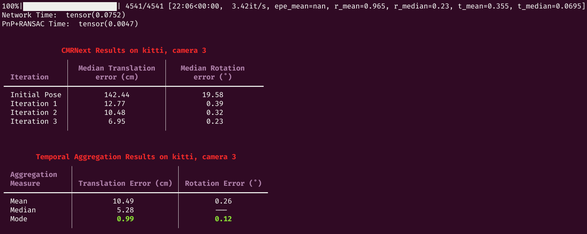

<div align="center" style="margin-top: 0; padding-top: 0; line-height: 1;">
    <h1>CMRNext: Camera to LiDAR Matching in the Wild for<br/>Localization and Extrinsic Calibration</h1>
    <a href="https://cmrnext.cs.uni-freiburg.de/" target="_blank" style="margin: 2px;"></a>
    <a href="https://github.com/robot-learning-freiburg/CMRNext/" target="_blank" style="margin: 2px;"></a>
    <a href="https://arxiv.org/abs/2402.00129" target="_blank" style="margin: 2px;"></a>
    <a href="https://ieeexplore.ieee.org/document/10908048" target="_blank" style="margin: 2px;"></a>
    <a href="https://github.com/robot-learning-freiburg/CMRNext/blob/main/LICENSE" target="_blank" style="margin: 2px;"></a>
</div>


Repository providing the source code for the paper
>CMRNext: Camera to LiDAR Matching in the Wild for Localization and Extrinsic Calibration
>
>[Daniele Cattaneo](https://rl.uni-freiburg.de/people/cattaneo) and [Abhinav Valada](https://rl.uni-freiburg.de/people/valada)  
>IEEE Transactions on Robotics, 2025.  

<p align="center">
  
</p>

If you use CMRNext, please cite:
```
@article{cattaneo2025cmrnext,
    title={CMRNext: Camera to LiDAR Matching in the Wild for Localization and Extrinsic Calibration}, 
    author={Daniele Cattaneo and Abhinav Valada},
    journal={IEEE Transactions on Robotics}, 
    year={2025},
    volume={41},
    pages={1995-2013},
    doi={10.1109/TRO.2025.3546784}
}
```

## News
- [x] 2025/05/07 - Localization inference code on Pandaset
- [x] 2025/05/02 - We released the [inference code for calibration on custom datasets](#Inference-on-your-own-dataset), and we added some visualization.
- [x] 2025/04/11 - We released the [inference code for monocular localization on Argoverse](#Monocular-Localization-in-LiDAR-Maps)
- [x] 2025/03/26 — We released the [inference code for extrinsic calibration](#Camera-LiDAR-Extrinsic-Calibration).
- [x] 2025/04/07 - We released the [inference code for monocular localization on KITTI](#Monocular-Localization-in-LiDAR-Maps)
- [x] 2025/03/25 — We released the ROS code for camera-LiDAR extrinsic calibration on KITTI using [MDPCalib](https://github.com/robot-learning-freiburg/MDPCalib/), which combines CMRNext with graph optimization.


## TODO
- [ ] Training code


## Abstract
LiDARs are widely used for mapping and localization in dynamic environments. However, their high cost limits their widespread adoption. On the other hand, monocular localization in LiDAR maps using inexpensive cameras is a cost-effective alternative for large-scale deployment. Nevertheless, most existing approaches struggle to generalize to new sensor setups and environments, requiring retraining or fine-tuning. In this paper, we present CMRNext, a novel approach for camera-LIDAR matching that is independent of sensor-specific parameters, generalizable, and can be used in the wild for monocular localization in LiDAR maps and camera-LiDAR extrinsic calibration. CMRNext exploits recent advances in deep neural networks for matching cross-modal data and standard geometric techniques for robust pose estimation. We reformulate the point-pixel matching problem as an optical flow estimation problem and solve the Perspective-n-Point problem based on the resulting correspondences to find the relative pose between the camera and the LiDAR point cloud. We extensively evaluate CMRNext on six different robotic platforms, including three publicly available datasets and three in-house robots. Our experimental evaluations demonstrate that CMRNext outperforms existing approaches on both tasks and effectively generalizes to previously unseen environments and sensor setups in a zero-shot manner.

## Datasets
The code natively supports the following datasets: [KITTI](#kitti), [Argoverse 1](#argoverse), and [Pandaset](#pandaset).

#### KITTI
Download the `KITTI Odometry` dataset available [here](https://www.cvlibs.net/datasets/kitti/eval_odometry.php).
All parts except for the grayscale images are required. Additionally, download the ground truth poses from [SemanticKITTI](https://semantic-kitti.org/dataset.html#download), specifically the `SemanticKITTI label data`.

After extracting all files (e.g., in the folder `\data\KITTI`), the folder structure should look like
```bash
\data\KITTI\sequences
├── 00
│   ├── image_2
│   │   ├── 000000.png
│   │   ├── 000001.png
│   │   ├── ...
│   │   └── 004540.png
│   ├── image_3
│   │   ├── 000000.png
│   │   ├── 000001.png
│   │   ├── ...
│   │   └── 004540.png
│   ├── velodyne
│   │   ├── 000000.bin
│   │   ├── 000001.bin
│   │   ├── ...
│   │   └── 004540.bin
│   └── poses.txt
│   └── calib.txt
└── 01
    ├── ...

```

#### Argoverse
Download the four train sets of `Argoverse 3D Tracking v1.1` from the [official website](https://www.argoverse.org/av1.html#download-link).
Extract all files (e.g., in the folder `\data\argoverse`)

#### Pandaset
Unfortunately, the pandaset dataset is not available for download from their [official website](https://scale.com/resources/download/pandaset) anymore.
An alternative download is available at [Kaggle](https://www.kaggle.com/datasets/pz19930809/pandaset), however I haven't tested it.

## Downloading model weights for extrinsic calibration

Please download the model weights for camera-LiDAR extrinsic calibration and for monocular localization in LiDAR maps and store them under: `/data/`.
- Calibration model weights: https://cmrnext.cs.uni-freiburg.de/downloads/cmrnext_calibration_weights.zip
- Localization model weights: https://cmrnext.cs.uni-freiburg.de/downloads/cmrnext_localization_weights.zip

## Docker
The best way to run CMRNext is by using Docker. Given the endless variability in system setups, many things can go wrong when configuring the environment manually. If you choose not to use Docker, it may be difficult for me to help troubleshoot any issues you encounter.

Install [Docker](https://docs.docker.com/engine/install/) and [NVIDIA Container Toolkit](https://docs.nvidia.com/datacenter/cloud-native/container-toolkit/latest/install-guide.html).
Tested with `Docker version 28.0.1` and `NVIDIA Container Toolkit version 1.17.5-1`

> [!CAUTION]
> The provided Docker container does NOT support NVIDIA RTX 50 Series (Blackwell).
> Adding support for it has low priority currently. Feel free to open a pull request.

- To build the image, run `docker build . -t cmrnext` in the root of this repository.
- Prepare using GUIs in the container: `xhost +local:docker`.
- Start container and mount the folder where your dataset are located: 
```bash
docker run --runtime=nvidia --shm-size=2g -it -v /tmp/.X11-unix:/tmp/.X11-unix -v PATH_TO_DATA:/data -e DISPLAY -e XAUTHORITY -e NVIDIA_DRIVER_CAPABILITIES=all cmrnext
```
- Within the container, move to the code folder `cd /root/CMRNext/`

## Camera-LiDAR Extrinsic Calibration

### Inference

Run the inference for camera-LiDAR extrinsic calibration, assuming the weights and the datasets are located under `\data\ `, change the paths according to your setup. Click on the specific dataset to see the exact command to run.
<details>
<summary>KITTI left camera:</summary>

```bash
python3 evaluate_flow_calibration.py --weights /data/cmrnext-calib-LEnc-iter1.tar /data/cmrnext-calib-LEnc-iter5.tar /data/cmrnext-calib-LEnc-iter6.tar --data_folder /data/KITTI/sequences/ --dataset kitti
```
Example results:
<p align="center">
  
</p>
</details>


<details>
<summary>KITTI right camera:</summary>

```bash
python3 evaluate_flow_calibration.py --weights /data/cmrnext-calib-LEnc-iter1.tar /data/cmrnext-calib-LEnc-iter5.tar /data/cmrnext-calib-LEnc-iter6.tar --data_folder /data/KITTI/sequences/ --dataset kitti --cam 3
```
Example results:
<p align="center">
  
</p>
</details>

<details>
<summary>Argoverse V1:</summary>

```bash
python3 evaluate_flow_calibration.py --weights /data/cmrnext-calib-LEnc-iter1.tar /data/cmrnext-calib-LEnc-iter5.tar /data/cmrnext-calib-LEnc-iter6.tar --data_folder /data/argoverse/argoverse-tracking/ --dataset argoverse
```
Example results:
<p align="center">
  
</p>
</details>

<details>
<summary>Pandaset:</summary>

```bash
python3 evaluate_flow_calibration.py --weights /data/cmrnext-calib-LEnc-iter1.tar /data/cmrnext-calib-LEnc-iter5.tar /data/cmrnext-calib-LEnc-iter6.tar --data_folder /data/pandaset/ --dataset pandaset
```
Example results:
<p align="center">
  
</p>
</details>

### Inference on your own dataset
To run extrinsic calibration on your own dataset, record multiple (the more, the better) synchronized image-point cloud pairs. The easiest way to do this, is to record one image-point cloud pair with the robot stationary, and repeat it at different locations.
> [!CAUTION]
> If you decide to record data while the robot is moving, then you have to make sure that point clouds are undistorted (motion compensated), and time-synchronized to match the timestamp of the camera. If you don't do that, there is no way to recover an accurate extrinsic calibration.

Then, place your **UNDISTORTED** images in a folder named `camera`, and your point clouds in a folder named `lidar`.
The filenames of matching camera and lidar pairs must be the same (except fot the extension).
Additionally, create a file named `calibration.yaml`, where you have to provide intrinsic parameters of your camera, and an initial extrinsic transformation.
The goal of this transformation is mostly to change the axis of the LiDAR such that it face the same direction of the camera.
Without an appropriate initial calibration, the method will not work.

We provide a sample dataset recorded with our in-house robot in `sample_custom_dataset`. The final folder structure should look like:
```bash
\data\custom_dataset\
├── camera
│   ├── 000000.png
│   ├── 000001.png
│   ├── ...
├── lidar
│   ├── 000000.pcd
│   ├── 000001.pcd
│   ├── ...
└── calibration.yaml
```
Different point clouds format are supported.
After your data is ready, run CMRNext:
```python
python3 evaluate_flow_calibration.py --weights /data/cmrnext-calib-LEnc-iter1.tar /data/cmrnext-calib-LEnc-iter5.tar /data/cmrnext-calib-LEnc-iter6.tar --data_folder ./sample_custom_dataset --dataset custom --num_worker 2 --quantile 1.0 --max_r 0 --max_t 0 --downsample --viz
```
The `--viz` is useful to visualize and debug, but will slow down the inference, you can remove it after checking that the initial projection and the predicted projection are as expected.
<details>
<summary>The visualization looks like this:</summary>
<p align="center">
  
</p>
</details>
If you see no points projection in the top image, or if the points are flipped 90 degrees, it means that the initial extrinsic calibration provided is incorrect.

The `--downsample` argument should give better results for most use cases, but if your camera images looks similar to the ones in the KITTI dataset, then you might try removing the argument and check if the results are better.

### Training
To train the Camera-LiDAR extrinsic calibration models, run the following commands:
```bash
python3 train_calibration.py  --savemodel /data/iter1/ --data_folder_argo /data/argoverse/argoverse-tracking/ --data_folder_kitti /data/KITTI/sequences/ --data_folder_panda /data/pandaset/ --max_r 20 --max_t 1.5
python3 train_calibration.py  --savemodel /data/iter2/ --data_folder_argo /data/argoverse/argoverse-tracking/ --data_folder_kitti /data/KITTI/sequences/ --data_folder_panda /data/pandaset/ --max_r 1 --max_t 0.1
python3 train_calibration.py  --savemodel /data/iter3/ --data_folder_argo /data/argoverse/argoverse-tracking/ --data_folder_kitti /data/KITTI/sequences/ --data_folder_panda /data/pandaset/ --max_r 0.2 --max_t 0.05
```

## Monocular Localization in LiDAR Maps
This section contains the steps to perform inference for monocular localization in LiDAR maps. First, we need to create the LiDAR maps for each dataset.

### LiDAR Map Generation

#### KITTI
To generate the LiDAR maps of the KITTI dataset, run the following commands one after the other:

```bash
python3 -m preprocess.kitti_maps_semantic --base_folder /data/KITTI/ --sequence 00
python3 -m preprocess.kitti_maps_semantic --base_folder /data/KITTI/ --sequence 03
python3 -m preprocess.kitti_maps_semantic --base_folder /data/KITTI/ --sequence 04
python3 -m preprocess.kitti_maps_semantic --base_folder /data/KITTI/ --sequence 05
python3 -m preprocess.kitti_maps_semantic --base_folder /data/KITTI/ --sequence 06
python3 -m preprocess.kitti_maps_semantic --base_folder /data/KITTI/ --sequence 07
python3 -m preprocess.kitti_maps_semantic --base_folder /data/KITTI/ --sequence 08
python3 -m preprocess.kitti_maps_semantic --base_folder /data/KITTI/ --sequence 09
```

#### Argoverse
To generate the LiDAR maps of the Argoverse dataset, run the following command:

```bash
python3 -m preprocess.argoverse --base_folder /data/argoverse/argoverse-tracking
```

#### Pandaset
To generate the LiDAR maps of the Pandaset dataset, run the following command:

```bash
python3 -m preprocess.pandaset --base_folder /data/pandaset
```

### Inference

Run the inference for monocular localization in LiDAR maps within the Docker container, assuming the weights and the datasets are located under `\data\ `. Change the paths according to your setup. Click on the specific dataset to see the exact command to run.
<details>
<summary>KITTI:</summary>

```bash
python3 evaluate_flow_localization.py --weights /data/cmrnext-iter1.tar /data/cmrnext-iter2.tar /data/cmrnext-iter3.tar --data_folder /data/KITTI/sequences/ --dataset kitti
```
</details>

<details>
<summary>Argoverse:</summary>

```bash
python3 evaluate_flow_localization.py --weights /data/cmrnext-iter1.tar /data/cmrnext-iter2.tar /data/cmrnext-iter3.tar --data_folder /data/argoverse/argoverse_tracking/ --dataset argoverse
```
</details>

<details>
<summary>Pandaset:</summary>

```bash
python3 evaluate_flow_localization.py --weights /data/cmrnext-iter1.tar /data/cmrnext-iter2.tar /data/cmrnext-iter3.tar --data_folder /data/pandaset/ --dataset pandaset
```
</details>

## Troubleshooting

In this section we cover common problems and how to solve them.
<details>
<summary>docker: Error response from daemon: Unknown runtime specified nvidia.</summary>

If you receive this error while starting the docker

```bash
docker: Error response from daemon: Unknown runtime specified nvidia.
```
Run the docker with this command instead:
```bash
docker run --gpus=all -it -v /tmp/.X11-unix:/tmp/.X11-unix -v PATH_TO_DATA:/data -e DISPLAY -e XAUTHORITY -e NVIDIA_DRIVER_CAPABILITIES=all cmrnext
```
</details>


## Acknowledgement
In our work and experiments, we have used components from other works. We thank the authors for open-sourcing their code.
- RAFT: https://github.com/princeton-vl/RAFT
- CMRNet: https://github.com/cattaneod/CMRNet
- https://github.com/dilaragokay/central-tendency-rotations/
- KISS-ICP: https://github.com/PRBonn/kiss-icp
- https://github.com/tomrunia/OpticalFlow_Visualization

## Contacts
* [Daniele Cattaneo](https://rl.uni-freiburg.de/people/cattaneo)
* [Abhinav Valada](https://rl.uni-freiburg.de/people/valada)

## License
For academic usage, the code is released under the [GPLv3](https://www.gnu.org/licenses/gpl-3.0.en.html) license. For any commercial purpose, please contact the authors.
